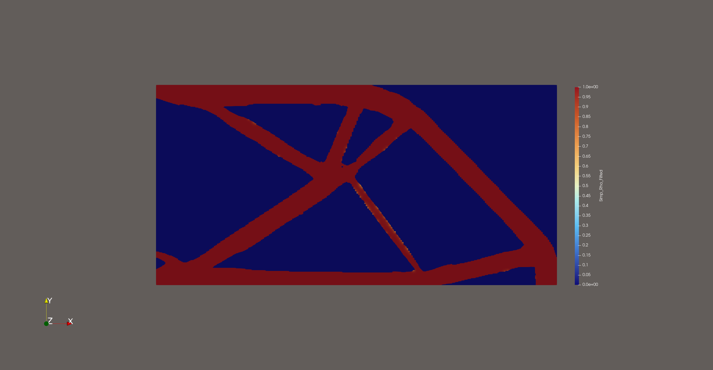
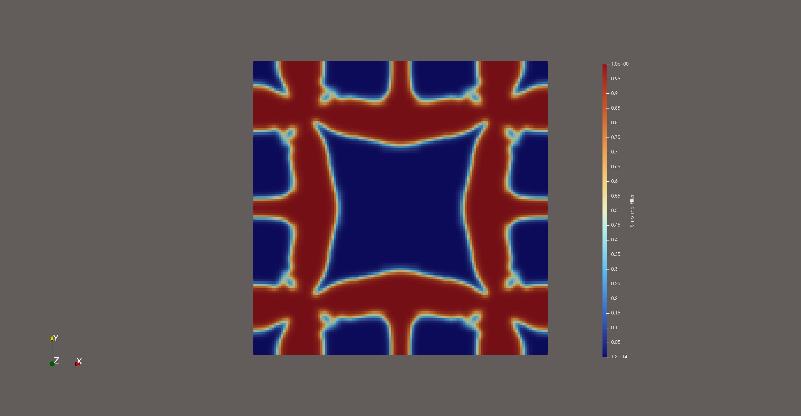
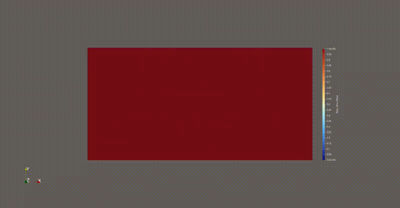
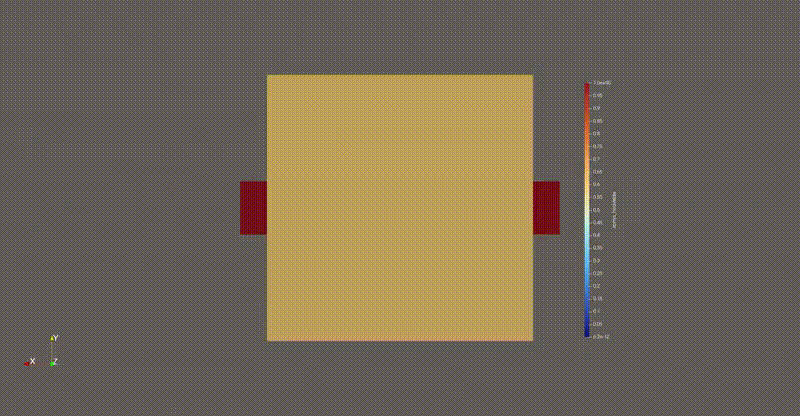
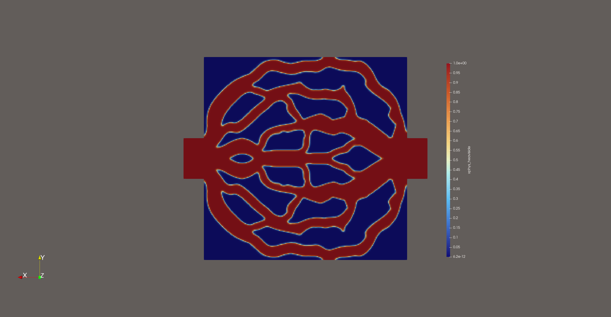
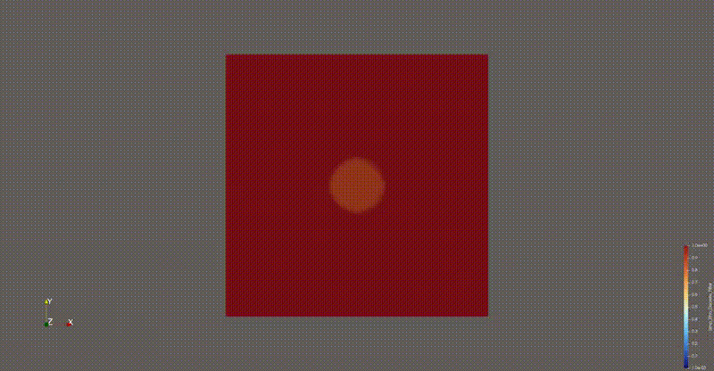
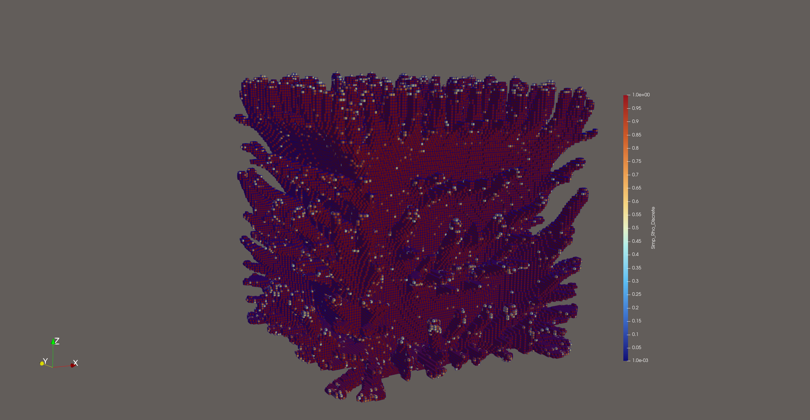
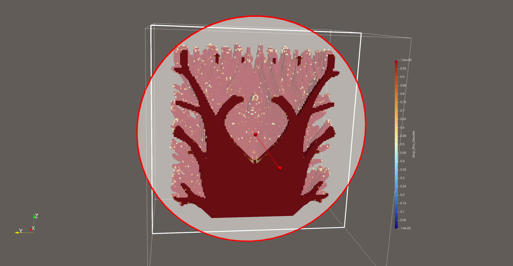
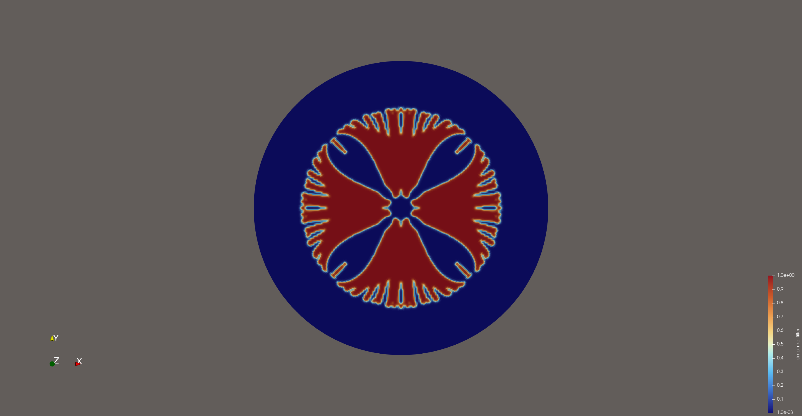

# Topology Optimization with deal.II

A collection of topology optimization programs based on [deal.II](https://www.dealii.org/), covering **structural mechanics**, **fluid dynamics**, and **heat transfer**. It contains **six independent subprojects**, all supporting MPI parallelism, continuous/discrete adjoint sensitivity analysis, and an MMA (Method of Moving Asymptotes) based optimization framework.



---

## 📖 Table of Contents

- [Project Structure](#-project-structure)
- [Subproject Overview](#-subproject-overview)
  - [1. Structural Inverse Homogenization](#1-structural-inverse-homogenization)
  - [2. Structural Optimization](#2-structural-optimization)
  - [3. NS Flow Thermal Optimization](#3-ns-flow-thermal-optimization)
  - [4. Matrix-Free Inverse Homogenization](#4-matrix-free-inverse-homogenization)
  - [5. Matrix-Free Heat Transfer Optimization](#5-matrix-free-heat-transfer-optimization)
  - [6. Transient Phase Change Material Topology Optimization](#6-transient-phase-change-material-topology-optimization)
- [Dependencies](#-dependencies)
- [Build](#-build)
- [Run](#-run)
- [License](#-license)

---

## 📁 Project Structure

```
.
├── CMakeLists.txt                              # Top-level CMake (configures all subprojects at once)
├── elasticity/                                 # Structural mechanics
│   ├── Structural Inverse Homogenization/      # Structural inverse homogenization
│   └── Structural Optimization/                # Structural optimization
├── navier-stokes/                              # Fluid dynamics
│   └── NS Flow Thermal Optimization/           # NS flow - thermal coupled topology optimization
├── thermal/                                    # Heat transfer
│   ├── MatrixFree Inverse Homogenization/      # Matrix-free inverse homogenization
│   ├── MatrixFree Optimization/                # Matrix-free heat transfer topology optimization
│   └── Transient Phase Change Material/        # Transient phase-change heat transfer topology optimization
├── fig/                                        # Images used in README
├── LICENSE
└── README.md
```

---

## 🎯 Subproject Overview

| Subproject | Physics | Method | Status |
|------------|---------|--------|--------|
| Structural Inverse Homogenization | Linear elasticity | Inverse homogenization | ✅ |
| Structural Optimization         | Linear elasticity | SIMP + filter | ✅ |
| NS Flow Thermal Optimization    | Navier-Stokes + temperature | SUPG/PSPG/LSIC + continuous adjoint | ✅ |
| MatrixFree Inverse Homogenization | Steady heat transfer | Matrix-free + multigrid | ✅ |
| MatrixFree Optimization          | Steady heat transfer | Matrix-free + multigrid | ✅ |
| Transient Phase Change Material  | Nonlinear transient heat transfer | Implicit time discretization + discrete adjoint | ✅ |

---

### 1. Structural Inverse Homogenization

**Structural Inverse Homogenization**

Inverse design of microstructures with a target effective elasticity tensor. Periodic boundary conditions and three independent load cases are applied to a unit cell to extract the effective elasticity moduli $C^H_{ijkl}$ and drive the MMA optimization.

- Finite element: `FE_Q(1)`, unit cell discretization
- Homogenization: effective elasticity tensor obtained from three independent auxiliary problems
- Objective: minimize the $L_2$ error between the effective tensor and the target value
- Sensitivity: discrete adjoint



---

### 2. Structural Optimization

**Structural Optimization**

Compliance minimization based on SIMP interpolation, with the classical cantilever beam example:

$$\min_{\rho} \; c(\rho) = \mathbf{u}^T \mathbf{K}(\rho) \mathbf{u} \quad \text{s.t.} \quad \frac{1}{|\Omega|}\sum_e \rho_e v_e \le V^*$$

- Density filtering (Helmholtz-type PDE filter)
- Heaviside projection to control the gray region
- Adjoint sensitivity of the objective and volume constraint
- MMA update
- Mesh Adapt

---

### 3. NS Flow Thermal Optimization

**NS Flow Thermal Optimization**

Coupled topology optimization of the incompressible Navier-Stokes equations and a convection-diffusion-reaction temperature equation. A Brinkman penalty term is used to separate solid and fluid regions:

$$\alpha(\rho)\mathbf{u} = \frac{\alpha_{\max}(1-\rho)}{\rho+\epsilon}\mathbf{u}$$

**Numerical methods**

- Element: velocity-pressure Taylor-Hood element
- Stabilization: SUPG (streamline upwind) / PSPG (pressure stabilization) / LSIC (least-squares incompressibility)
- Nonlinear: Newton iteration + line search
- Time integration: transient handled by PETSc TS (implicit)

**Optimization problem**

- Objective: mean temperature / heat exchange / entransy dissipation / outlet mean temperature ...
- Constraints: flow dissipation / pump power / inlet pressure / volume fraction
- Sensitivity: continuous adjoint (velocity-pressure-temperature three-field coupling)





- ...,*Xianglei Zeng*, ...
Topology optimization of 3D conformal cooling channels using within-surface flow model,
Applied Thermal Engineering,
Volume 267,
2025,
125765,
ISSN 1359-4311,
https://doi.org/10.1016/j.applthermaleng.2025.125765.

---

### 4. Matrix-Free Inverse Homogenization

**Matrix-Free Inverse Homogenization**

Thermal inverse homogenization: design microstructures with a target effective thermal conductivity tensor.

- Uses deal.II's `MatrixFree` framework: **no global matrix assembly**
- Multigrid preconditioning (geometric MG + Chebyshev smoother)
- Each `vmult` only loops over cells for local computation; memory usage is **almost independent of the number of DoFs**
- Objective: match the effective thermal conductivity tensor $\kappa^H_{ij}$ to the target value


---

### 5. Matrix-Free Heat Transfer Optimization

**MatrixFree Optimization**

Heat transfer topology optimization based on `MatrixFree`, sharing the underlying solver with subproject 4.

- Steady heat equation: $-\nabla \cdot (\kappa(\rho) \nabla T) = f$
- Material interpolation: RAMP / SIMP
- Objective: minimize thermal compliance or the mean temperature in a specified region
- Large-scale problems (> 10^7 DoF) can be solved efficiently on a workstation





---

### 6. Transient Phase Change Material Topology Optimization

**Transient Phase Change Material**

Topology optimization of transient heat transfer in phase-change materials (PCM). Based on **fully implicit time discretization** and the **discrete adjoint** method.

**Physical model**

- Effective heat capacity of the PCM, $c_p(T, \rho)$, varies nonlinearly with temperature
- The phase-change interval is smoothed by a transition function (Heaviside / trigonometric)
- Material properties interpolated by SIMP / ordered SIMP

**Time discretization and adjoint**

- Implicit time stepping with PETSc TS (`THETA` / `BDF`)
- Objective: transient temperature variance $r = \frac{1}{N}\sum_i (T_i - \bar{T})^2$
- Discrete adjoint: solved backward from the final time step
  $$\left(\frac{\partial F}{\partial \dot u}\right)^T \lambda_{n+1} - \left(\frac{\partial F}{\partial u}\right)^T \lambda_n = \left(\frac{\partial r}{\partial u}\right)^T$$
- Final sensitivity: $\frac{dr}{d\rho} = -\sum_n \lambda_n^T \frac{\partial F}{\partial \rho}$

**Key implementation**

| File | Purpose |
|------|---------|
| `Forward_Solver.cpp` | Forward nonlinear time stepping |
| `Adjoint_Solver.cpp` | Discrete adjoint solve |
| `Helmholtz_Equation.cpp` | Density filtering |
| `PCM.cpp` | Phase-change enthalpy-temperature relation |
| `SIMP.cpp` | Material interpolation |
| `Deal_II_MMA_Parallel.cpp` | Parallel MMA |


<video src="fig/HeatTranOpt-100s.mp4" autoplay loop muted playsinline width="600"></video>
---

## 📦 Dependencies

| Dependency | Version | Description |
|------------|---------|-------------|
| **deal.II** | ≥ 9.5 (9.6+ recommended) | Finite element framework |
| **MPI** | OpenMPI / MPICH | Distributed parallelism |
| **PETSc** | ≥ 3.15 (with MUMPS) | Linear/nonlinear solvers, time stepping |
| **p4est** | ≥ 2.2 | Distributed adaptive mesh |
| **CMake** | ≥ 3.27 | Build system |
| **C++ compiler** | C++17 support | gcc ≥ 9 / clang ≥ 10 |

> If the matrix-free modules are used, deal.II must be built with `DEAL_II_WITH_MATRIX_FREE` support.

---

## 🔧 Build

### Top-level build (recommended)

```bash
git clone <this-repo> && cd <this-repo>
mkdir build && cd build
cmake -DDEAL_II_DIR=/path/to/deal.II ..
make -j$(nproc)
```

After compilation, all six executables are located in `build/bin/`:

```
build/bin/
├── StructuralInHomOpt
├── StructuralOpt
├── NSHeatFlowTopOpt
├── HeatMFInHomOpt
├── HeatMFOpt
└── HeatTransientPCMOpt
```

### Build a single subproject

```bash
cd "thermal/Transient Phase Change Material"
mkdir build && cd build
cmake -DDEAL_II_DIR=/path/to/deal.II ..
make -j$(nproc)
```

### Common errors

- **`add_executable called with incorrect number of arguments`**
  `TARGET_SRC` in the subproject `CMakeLists.txt` is empty. Check whether `src/*.cpp` exists and change `file(GLOB_RECURSE ...)` to an absolute path:
  ```cmake
  file(GLOB_RECURSE TARGET_SRC
       "${CMAKE_CURRENT_SOURCE_DIR}/src/*.cpp")
  ```
- **`set(CMAKE_CXX_COMPILER, "...")`**
  The comma is redundant and will be parsed as part of the variable name. Write:
  ```cmake
  set(CMAKE_CXX_COMPILER "/usr/bin/mpicxx")
  ```

---

## ▶️ Run

Each subproject supports MPI parallelism. Place the compiled executable and the parameter file in the same working directory:

```bash
# Structural optimization (4 processes)
mpirun -np 4 ./bin/structural_optimization

# NS flow and thermal coupled optimization (8 processes)
mpirun -np 8 ./bin/ns_flow_thermal_optimization

# Transient phase-change heat transfer (16 processes)
mpirun -np 16 ./bin/transient_phase_change_material
```

After the run, `.vtu` result files are generated in the current directory and can be opened with [ParaView](https://www.paraview.org/):

- `xphys`: design variable distribution
- `temperature` / `velocity` / `pressure`: physical fields
- `sens_*`: sensitivity fields of objectives or constraints

Some subprojects allow adjustments via `parameters.prm`:

```bash
# Example: modify volume fraction and filter radius for the PCM module
subsubsection Optimization
  set Volume fraction = 0.3
  set Filter radius   = 0.05
end
```

---

## 📚 References

1. Svanberg, K. (1987). *The method of moving asymptotes—a new method for structural optimization*. IJNME.
2. Svanberg, K. (2002). *A class of globally convergent optimization methods based on conservative convex separable approximations*. SIAM J. Optim.
3. Bendsøe, M. P., & Sigmund, O. (2003). *Topology Optimization: Theory, Methods, and Applications*. Springer.
4. Borrvall, T., & Petersson, J. (2003). *Topology optimization of fluids in Stokes flow*. IJNMF.
5. Sigmund, O., & Maute, K. (2013). *Topology optimization approaches*. SMO.
6. Kollmannsberger, S. et al. (2019). *Parameter-free, matrix-free finite element methods*. Wiley.
7. deal.II documentation: https://www.dealii.org/
8. MMA Code from https://github.com/topopt/TopOpt_in_PETSc.git
9. Aage, N., et al. (2015). *Topology optimization using PETSc: An easy-to-use, fully parallel, open source topology optimization framework.* Structural and Multidisciplinary Optimization, 51(3), 565–572. https://doi.org/10.1007/s00158-014-1157-0
---

## 📄 License

This project is licensed under the [MIT License](LICENSE).

---

## 🙏 Acknowledgements

This project is built on the [deal.II](https://www.dealii.org/) finite element library and uses open-source components such as [PETSc](https://petsc.org/) and [p4est](https://www.p4est.org/). Special thanks to the deal.II community for the extensive tutorials and examples.

Issues and pull requests are welcome.
